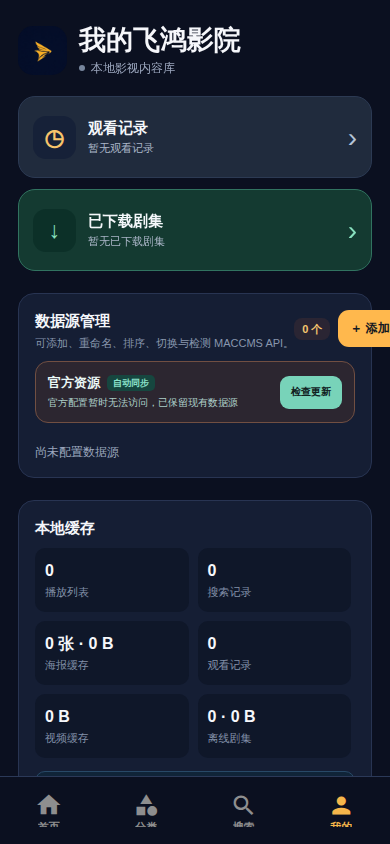

# 飞鸿影院

> 基于 **Expo / React Native** 的 Android 影视浏览应用。它可连接符合 MACCMS 接口规范的数据源，提供分类浏览、搜索、线路与剧集选择、观看记录和本地离线管理等功能。

## 项目概览

飞鸿影院面向 Android 手机与模拟器设计，当前版本为 **fsvod-mobile-1.1.0**。应用采用黑金视觉主题，并将影视数据源、浏览记录、搜索记录与下载任务保存在设备本地。项目默认 Android 最低版本为 **Android 7.0（API 24）**。

| 项目 | 内容 |
|---|---|
| 应用名称 | 飞鸿影院 |
| 应用标识 | `fsvod-mobile` |
| 技术栈 | Expo SDK 54、React Native 0.81、TypeScript、Expo Router |
| 支持平台 | Android 真机、Android 模拟器、Expo Go 开发调试 |
| 数据接口 | MACCMS API |
| 最低 Android 版本 | Android 7.0 / API 24 |

## 应用界面预览

以下截图以 **390 × 844** 的手机纵向预览采集，展示首次接入数据源与“我的”页面的数据源管理、本地缓存和下载入口。截图使用干净的本地预览会话，不包含用户自行添加的数据源、影视内容或个人观看记录。




## 功能

应用只负责连接用户有权使用的 MACCMS 数据源，不内置或托管任何影视内容。

| 模块 | 已实现能力 |
|---|---|
| 数据源 | 输入域名自动识别接口；添加、编辑、排序和健康检测；多资源快速切换 |
| 官方资源 | 支持从官方 JSON 同步资源清单、主备 JSON 地址切换和自动更新已下发资源 |
| 资源状态 | 首页、分类、详情与“我的”页可点击状态圆点和资源名称进行切换；当前源会显示“当前使用 · 连接正常 / 连接异常 / 待检测” |
| 分类与搜索 | 一级、二级分类识别并按 ID 排序；三列海报列表；自动、手动、经典三种分页方式 |
| 影片详情 | 影片信息、播放线路、剧集列表、观看记录、下载入口与本地缓存状态 |
| 播放 | 网络播放、下载内容优先离线播放、上/下一集、进度记忆、播放线路切换与返回介绍页 |
| 下载与离线 | 单集或整部剧集下载、队列暂停/继续/重试/删除、容量上限和已下载内容直接播放 |
| 本地缓存 | 播放列表、搜索记录、海报、观看记录、离线剧集与视频缓存的统计、选择性清理和二次确认 |

## 开发环境

建议使用 Node.js 20 或 22、pnpm 9+ 与 Android Studio。首次运行前安装依赖并进行静态检查：

```bash
git clone https://github.com/yimeo/fsvod-mobile.git
cd fsvod-mobile
pnpm install --frozen-lockfile
pnpm exec tsc --noEmit
pnpm exec vitest run
```

启动开发服务后，可使用 Android 模拟器或安装 Expo Go 的 Android 设备进行调试：

```bash
pnpm run dev
```

## 在 Android 设备或模拟器中运行

请先在 Android Studio 中启动模拟器，或使用 USB 连接已开启“USB 调试”的 Android 设备。随后运行以下命令生成原生工程、安装调试包并启动开发服务：

```bash
pnpm exec expo run:android --device
```

调试 APK 通常生成在：

```text
android/app/build/outputs/apk/debug/app-debug.apk
```

关于 Windows、macOS 与 Linux 的完整环境配置、仅生成 APK 的命令、Android 12 播放器稳定性复测，以及发布签名注意事项，请阅读 [本地 Android 构建指南](./LOCAL_ANDROID_BUILD.md)。

## 数据源说明

在“我的 → 数据源管理”中添加用户有权使用的 MACCMS 资源地址。应用会自动尝试识别常见接口路径；资源名称为空时，将以域名作为显示名。连接状态使用以下语义：

| 状态 | 含义 | 界面颜色 |
|---|---|---|
| 连接正常 | 最近一次接口检测成功 | 绿色 |
| 连接异常 | 最近一次接口请求失败或返回不可用 | 橙红色 |
| 待检测 | 尚未完成检测 | 灰色 |

当前使用的资源不会掩盖检测结果。例如，当前资源不可访问时，快速切换弹窗会显示 **“当前使用 · 连接异常”**，并以橙红色标明状态。带有“官方”标志的条目来自官方资源清单。

## 验证

提交代码前请执行：

```bash
pnpm exec tsc --noEmit
pnpm exec vitest run
```

播放器涉及设备原生媒体组件。除自动化测试外，建议至少在目标 Android 版本上验证：未开始播放时切换线路、播放中切换线路、返回影片详情、上一集和下一集。

## 内容与使用规范

请仅接入拥有合法使用授权的接口与内容。使用者应自行确认数据源、影视内容、下载行为及本地存储均符合所在地法律、平台规则和权利人的授权要求。请勿将签名密钥、密码、令牌或 `credentials.json` 提交到仓库。

## 相关仓库

| 项目 | 说明 |
|---|---|
| [fsvod-mobile](https://github.com/yimeo/fsvod-mobile) | Android 手机端 Expo / React Native 源码 |
| [fsvod-tv](https://github.com/yimeo/fsvod-tv) | 面向 Android TV（API 21）的独立原生 Java 版本 |

## 参考资料

[1] [Expo 本地 Android 开发指南](https://docs.expo.dev/guides/local-app-development/)

[2] [Expo 本地发布构建指南](https://docs.expo.dev/guides/local-app-production/)
